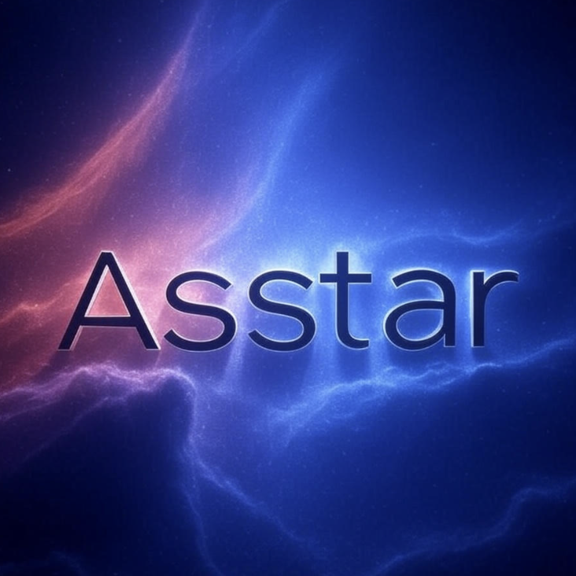

# Asstar - 探索未知的边界

 <!-- 替换为你的网站 logo 链接 -->

**Asstar** 是一个激发灵感与探索的在线平台，致力于带领用户跨越已知边界，探寻未知的无限可能。我们为好奇心旺盛的探险家、创作者和学习者打造了一个独特而引人入胜的空间。

---

## 🌟 关于 Asstar

Asstar 是一个以探索为核心的网站，通过前沿技术、沉浸式体验和多样化内容，带你发现科学、艺术、技术等领域的无限魅力。我们希望每位用户都能在这里找到灵感，点燃好奇心，开启属于自己的探索之旅。

- **核心理念**: 探索、发现、创造
- **目标用户**: 好奇心驱动的探险家、创作者和终身学习者
- **愿景**: 打破常规，连接未知，激发无限可能

---

## 🚀 核心功能

- **探索模块**: 浏览涵盖科学、艺术、技术等多领域的精选内容，激发你的灵感。
- **沉浸式体验**: 动态的界面设计和流畅的交互，带来无缝的浏览体验。
- **AI对话**: 基于通义千问的智能聊天助手，提供问题解答和创作建议。
- **个性化推荐**: 根据你的兴趣定制内容，打造专属的探索旅程。
- **社区互动**: 连接全球的探索者，分享发现、交流创意。
- **响应式设计**: 完美适配桌面和移动设备，随时随地探索。

---

## 📸 网站预览

 <!-- 替换为你的网站截图链接 -->

> **立即体验**: 访问 [Asstar 官网](https://asstar-x.github.io/) 开启你的探索之旅！ <!-- 替换为你的网站链接 -->

---

## 📖 如何开始

1. **访问网站**: 打开 [Asstar 官网](https://asstar-x.github.io/) 开始探索。
2. **AI对话**: 点击导航栏中的"Prompt提示词"，与AI助手进行智能对话。
3. **发现内容**: 浏览推荐内容，或通过搜索查找你感兴趣的主题。
4. **定制旅程**: 调整个人偏好，获取专属推荐。
5. **加入社区**: 参与讨论，与志同道合的探索者分享你的发现！

### 🤖 AI对话功能

- **获取API密钥**: 访问[阿里云通义千问控制台](https://dashscope.console.aliyun.com/)获取API密钥
- **配置密钥**: 在提示词页面设置你的API密钥
- **开始对话**: 与AI助手进行实时对话，获得问题解答和创作建议
- **详细说明**: 查看 [PROMPT_README.md](./PROMPT_README.md) 了解完整使用指南

---

## 🤝 加入我们

我们欢迎每一位热爱探索的用户！通过以下方式与我们互动：

- **官网**: [Asstar](https://asstar-x.github.io/)
- **邮箱**: yxy138646@163.com
- **社区**: [加入我们的群组](WX：AiSpinLab)
- **反馈**: 在 GitHub Issues 中提交建议或想法

---

## 📄 许可证

本项目采用 [MIT 许可证](LICENSE) - 详情请见 LICENSE 文件。

---

**Asstar - 探索未知的边界**  
与我们一起，踏上发现之旅，探索无限可能！