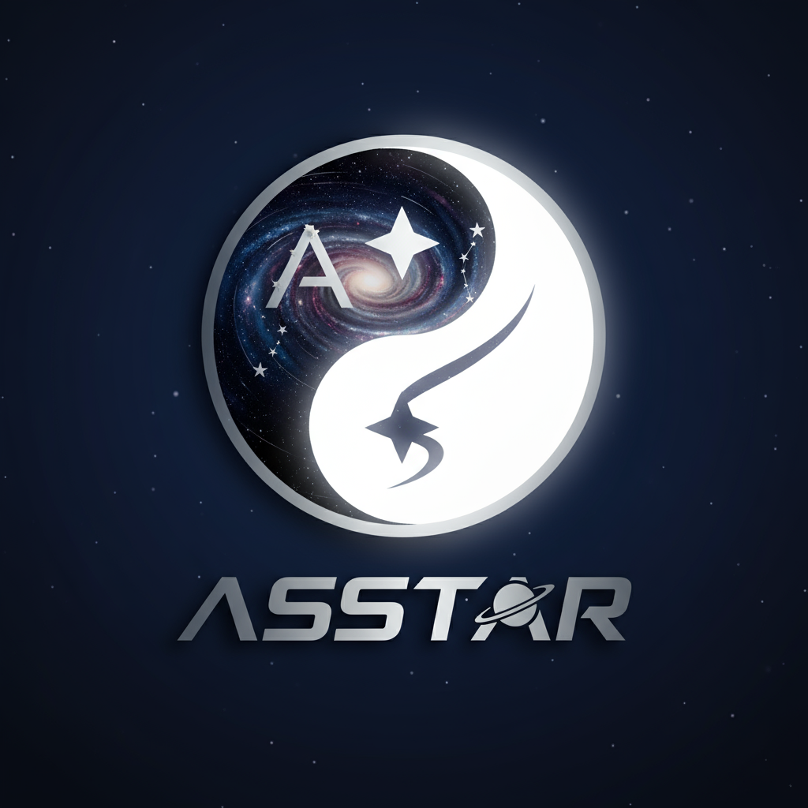
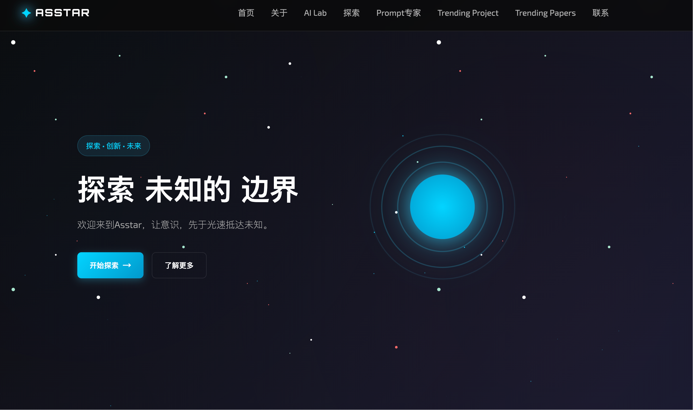

# Asstar - 探索未知的边界

<div style="display: flex; align-items: center; gap: 20px; flex-wrap: wrap;">
  
  <div style="flex: 1; min-width: 300px;">
    Asstar 是一个激发灵感与探索的在线平台，致力于带领用户跨越已知边界，探寻未知的无限可能。我们为好奇心旺盛的探险家、创作者和学习者打造了一个独特而引人入胜的空间。
  </div>
</div>

---

## 🌟 关于 Asstar

Asstar 是一个以探索为核心的网站，通过前沿技术、沉浸式体验和多样化内容，带你发现科学、艺术、技术等领域的无限魅力。我们希望每位用户都能在这里找到灵感，点燃好奇心，开启属于自己的探索之旅。

- **核心理念**: 探索、发现、创造
- **目标用户**: 好奇心驱动的探险家、创作者和终身学习者
- **愿景**: 打破常规，连接未知，激发无限可能

---

## 🚀 核心功能

- **探索模块**: 浏览涵盖科学、艺术、技术等多领域的精选内容，激发你的灵感。
- **GitHub Trending**: 实时展示GitHub社区最热门的开源项目，支持每日、每周、每月趋势查看。
- **HuggingFace Trending**: 实时展示AI社区最热门的模型和数据集，支持Trending、Most Likes、Most Downloads分类 ✨
- **沉浸式体验**: 动态的界面设计和流畅的交互，带来无缝的浏览体验。
- **AI对话**: 基于通义千问的智能聊天助手，提供问题解答和创作建议。
- **太空探索**: 连接全球的探索者，分享发现、交流创意。
- **响应式设计**: 完美适配桌面和移动设备，随时随地探索。

---

## 📸 网站预览

 <!-- 替换为你的网站截图链接 -->

> **立即体验**: 访问 [Asstar 官网](https://asstar-x.github.io/) 开启你的探索之旅！ <!-- 替换为你的网站链接 -->

---

## 📖 如何开始

1. **访问网站**: 打开 [Asstar 官网](https://asstar-x.github.io/) 开始探索。
2. **AI对话**: 点击导航栏中的"Prompt提示词"，与AI助手进行智能对话。
3. **发现内容**: 浏览推荐内容，或通过搜索查找你感兴趣的主题。
4. **太空探索**: 寻找志同道合的朋友。
5. **加入社区**: 参与讨论，与志同道合的探索者分享你的发现！

## 🛠️ 项目管理和部署

### 使用统一管理脚本 ✨

我们提供了一个统一的脚本管理系统，简化了项目的部署和维护：

```bash
# 显示帮助信息
./manage.sh help

# 部署网站到GitHub Pages
./manage.sh deploy

# 设置GitHub Action自动化功能
./manage.sh setup

# 手动更新数据
./manage.sh update github      # 更新GitHub Trending
./manage.sh update huggingface # 更新HuggingFace数据
./manage.sh update all         # 更新所有数据

# 测试所有功能
./manage.sh test

# 检查项目状态
./manage.sh status
```

### 传统方式（仍然可用）

```bash
# 部署网站
./deploy.sh

# 设置GitHub Action
./setup-github-action.sh

# 更新HuggingFace数据
./scripts/update_huggingface.sh
```

### 🤖 Prompt高级提示词优化功能

- **获取API密钥**: 访问[阿里云通义千问控制台](https://dashscope.console.aliyun.com/)获取API密钥
- **配置密钥**: 在提示词页面设置你的API密钥
- **开始对话**: 与AI助手进行实时对话，获得问题解答和创作建议

### 📊 GitHub Trending功能

- **实时数据**: 通过GitHub Actions自动更新，每天凌晨2点获取最新趋势数据
- **时间筛选**: 支持查看每日、每周、每月的热门项目
- **项目详情**: 显示项目描述、编程语言、星标数、Fork数等详细信息
- **直接访问**: 点击项目卡片可直接跳转到GitHub仓库页面

### 🤖 HuggingFace Model Trending功能 ✨

- **实时数据**: 通过GitHub Actions自动更新，每天凌晨3点获取最新模型趋势数据
- **分类筛选**: 支持Trending、Most Likes、Most Downloads三种分类
- **模型详情**: 显示模型描述、任务类型、参数数量、点赞数、下载数、标签等详细信息
- **直接访问**: 点击模型卡片可直接跳转到HuggingFace模型页面

##  🌍 兴趣太空
- **多元探索**：涵盖科技、设计、艺术、AI、开源文化、独立开发等前沿领域
- **精选推荐**：每周更新值得关注的项目、工具、博客与创作者
- **灵感碰撞**：记录有趣的想法实验、DIY项目与学习路径分享
- **自由连接**：每个推荐都附带直达链接，一键抵达灵感源头

## 🤝 加入我们

我们欢迎每一位热爱探索的用户！通过以下方式与我们互动：

- **官网**: [Asstar](https://asstar-x.github.io/)
- **邮箱**: asstarx7@gmail.com
- **社区**: WX：AiSpinLab
- **反馈**: 在 GitHub Issues 中提交建议或想法

---

## 📄 许可证

本项目采用 [MIT 许可证](LICENSE) - 详情请见 LICENSE 文件。

---

**Asstar - 探索未知的边界**  
与我们一起，踏上发现之旅，探索无限可能！
